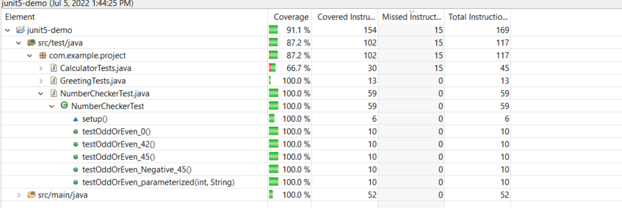

# TDD 

To increase overall system quality and avoid defects, it’s important to test your projects.

Test-driven development (TDD) is a software development process that software requirements are converted to test cases before software is fully developed. TDD tracks all software development by repeatedly testing software against all test cases.

TDD process is as opposed to software being developed first and test cases created later.

# Java Unit testing
## basics
```java
    @Test
	public void testSayHello() {
		
		Greeting greeting = new Greeting();
		assertEquals("Hello leo. Welcome!", greeting.sayHello("leo"));
	}
```
With requirements and test case settled down. Implement `Greeting` class as:
```java
public class Greeting {
	
	public String sayHello(String name) {
		
		return String.format("Hello %s. Welcome!", name);
	}

}

```
## Refactoring

Refactor testcases step by step.
- pass test case with number 45.
```java
    @Test
	@DisplayName("45 is an odd number")
	public void testOddOrEven_45() {
		
		NumberChecker numberChecker = new NumberChecker();
		assertEquals("45 is an odd number", numberChecker.oddOrEven(45));
	}
```
NumberChecker#oddOrEven implementation
```java
public String oddOrEven(int number) {
		
		if (number % 2 == 1) {
			return String.format("%s is an odd number", number);
		} 

		return "";
	}
```
- test case with number 42. The test will fail first. Refactor oddOrEven method to pass the testcase.
```java
public String oddOrEven(int number) {
		
		if (number % 2 == 1) {
			return String.format("%s is an odd number", number);
		} else {
			return String.format("%s is an even number", number);
		}
	}
```
- pass test case with number 0
- test case with number -45. The test will fail first. Refactor oddOrEven method to pass the testcase.
```java
public String oddOrEven(int number) {
		
		if (number % 2 == 1) {
			return String.format("%s is an odd number", number);
		} else {
			return String.format("%s is an even number", number);
		}
	}
```
- refactor with parameterized test
``` java
@ParameterizedTest
	@CsvSource({
		"45,45 is an odd number",
		"42,42 is an even number",
		"0,0 is an even number",
		"-45,-45 is an odd number"
	})
	public void testOddOrEven_parameterized(int number, String expectedMessage) {
		NumberChecker numberChecker = new NumberChecker();
		assertEquals(expectedMessage, numberChecker.oddOrEven(number));
	}
```

## Coverage 

Run with coverage test. (IDE support eclipse or IDEA)

# Mockito Testing
SayHello method from Greeting changed. Now, sayHello will retrieve name from a datasource. We retrieve name from names.csv.
To make the test pass. we need to use mock test.
```java
@Test
	public void testSayHello() {
		NameGenerator generator = Mockito.mock(NameGenerator.class);
		Mockito.when(generator.generateName()).thenReturn("leo");

		Greeting greeting = new Greeting();
		greeting.setGenerator(generator);
		assertEquals("Hello leo. Welcome!", greeting.sayHello());
	}
```
In order to test if NameGenerator function, we need to know we get actual name. Test return greeting with regex pattern.
```java 
@Test
	public void testSayHello() {

		Greeting greeting = new Greeting();
		boolean matched = greeting.sayHello().matches("Hello [a-zA-Z]+. Welcome!");
		assertTrue(matched);
	}

```