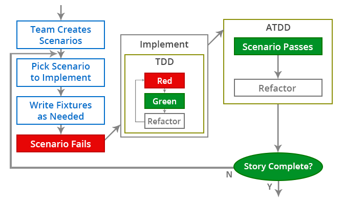

# TDD Overview

To increase overall system quality and avoid defects, it’s important to test your projects. Test-driven development (TDD) is a software development process that software requirements are converted to test cases before software is fully developed. TDD tracks all software development by repeatedly testing software against all test cases.  

TDD process is based on the principle that we should write small codes rather than writing long codes. In TDD, whenever we want to add more functionality in our codes, we first have to wrte a test for that. After that, we add new functionality with small code lines combined and then test it with our test.  

TDD helps use to reduce the risks of encountering significant problems at the production level.  
<br>

# TDD process cycle & workflow

## Three stages involved in process cycle of TDD.
- writing a fialed test
- Make the test pass
- Refactor  
  


## Detailed workflow of TDD.



# BDD vs TDD
- Behavior Driven testing is similar to Test Driven Development, in the way that in BDD also tests are written first and tested and then more code is added to it to make the test pass.  
- The major area where these two differ is that tests in BDD are written in plain descriptive English type grammar whereas tests in TDD are written in unit test.
- Tests in BDD aim at explaining the behavior of the application and are also more user-focused whereas Tests in TDD aim at making tests pass to ensure codes are functioning correctly.

# Unit Testing vs Integration Testing
Unit testing operates on source code level. One unit test always correlates to one piece of functionality.  
Unit testing works on functionalities which are independent of each other.
   
Integration Testing happens after Unit Testing which validates software functionalities work correctly when combined with each other.

# Java Unit testing
## sayHello example - basics 
```java
@Test
public void testSayHello() {
	Greeting greeting = new Greeting();
	assertEquals("Hello leo. Welcome!", greeting.sayHello("leo"));
}
```
With requirements and test case settled down. Implement `Greeting` class as:
```java
public class Greeting {
	public String sayHello(String name) {
		return String.format("Hello %s. Welcome!", name);
	}
}

```
## TestOddOrEven - subtests, refactoring, coverage

Refactor testcases step by step.
- pass test case with number 45.
```java
@Test
@DisplayName("45 is an odd number")
public void testOddOrEven_45() {
	NumberChecker numberChecker = new NumberChecker();
	assertEquals("45 is an odd number", numberChecker.oddOrEven(45));
}
```
NumberChecker#oddOrEven implementation
```java
public String oddOrEven(int number) {
	if (number % 2 == 1) {
		return String.format("%s is an odd number", number);
	} 
	return "";
}
```
- test case with number 42. The test will fail first. Refactor oddOrEven method to pass the testcase.
```java
public String oddOrEven(int number) {
	if (number % 2 == 1) {
		return String.format("%s is an odd number", number);
	} else {
		return String.format("%s is an even number", number);
	}
}
```
- pass test case with number 0
- test case with number -45. The test will fail first. Refactor oddOrEven method to pass the testcase.
```java
public String oddOrEven(int number) {
	if (number % 2 == 1 || number % 2 == -1) {
		return String.format("%s is an odd number", number);
	} else {
		return String.format("%s is an even number", number);
	}
}
```
- refactor with parameterized test
``` java
@ParameterizedTest
@CsvSource({
	"45,45 is an odd number",
	"42,42 is an even number",
	"0,0 is an even number",
	"-45,-45 is an odd number"
})
public void testOddOrEven_parameterized(int number, String expectedMessage) {
	NumberChecker numberChecker = new NumberChecker();
	assertEquals(expectedMessage, numberChecker.oddOrEven(number));
}
```

## Test Coverage 

Run with coverage test. (IDE support eclipse or IDEA)

# Mock Testing
Mock testing is an approach to unit testing that lets you make assertions about how the code under test is interacting with other system modules. In mock testing, the dependencies are replaced with objects that simulate the behaviour of the real ones. The purpose of mocking is to isolate and focus on the code being tested and not on the behaviour or state of external dependencies.
## Mock testing with Mockito framwork.
SayHello method from Greeting changed. Now, sayHello will retrieve a name from a datasource. We retrieve name from names.csv.
To make the test pass. we need to use mock test.
```java
@Test
public void testSayHello() {
	NameGenerator generator = Mockito.mock(NameGenerator.class);
	Mockito.when(generator.generateName()).thenReturn("leo");

	Greeting greeting = new Greeting();
	greeting.setGenerator(generator);
	assertEquals("Hello leo. Welcome!", greeting.sayHello());
}
```
In order to test if NameGenerator function, we need to know we get actual name. Test return greeting with regex pattern.
```java 
@Test
public void testSayHello() {
	Greeting greeting = new Greeting();
	boolean matched = greeting.sayHello().matches("Hello [a-zA-Z]+. Welcome!");
	assertTrue(matched);
}

```